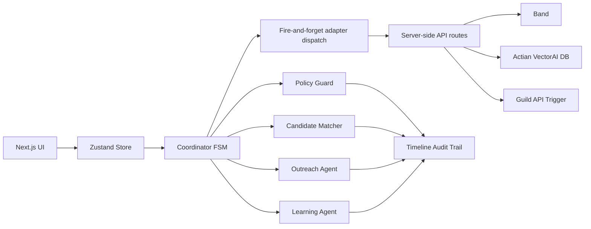

# Blankless

**No blank slots. No wasted capacity.**

Blankless is a deterministic hackathon demo of an autonomous appointment-recovery system for outpatient clinics. A cancellation triggers an auditable finite-state workflow that filters, ranks, contacts, confirms, and learns from waitlist outcomes.

## Demo spine

1. Scenario 1 cancels a Tuesday 2:30 PM dermatology follow-up.
2. Policy Guard blocks ineligible candidates with named rules.
3. Sofia declines an afternoon offer; Maya accepts.
4. Policy v2 raises time-of-day preference from 5% to 11%.
5. Scenario 2 ranks afternoon-flexible Chloe first and fills in one attempt.

## Architecture



The code is one deterministic workflow engine with pure modules. Persona labels are presentation and audit identities, not free-form agents chatting with each other.

## Local setup

```bash
npm install
cp .env.example .env.local
npm run dev
```

Open `http://localhost:3000`, run Scenario 1, then Scenario 2.

## Verification

```bash
npm test
npm run build
```

## Safety and resilience

- Hard constraints run before scoring.
- Every block names its rule.
- A single-fill lock is enforced before recovery confirmation.
- No database, auth, live SMS, EHR connection, or real patient data.
- The entire demo works with an empty `.env`.
- Client dispatch is fire-and-forget. Every adapter call is isolated in `try/catch` and only emits `console.warn`, so sponsor outages never enter the FSM.

## Integrations

### Adapter pattern and empty-env guarantee

`lib/integrations/types.ts` defines one shared lifecycle contract: workflow start, timeline event, and workflow end. The browser sends non-blocking POSTs to `app/api/integrations/[adapter]/route.ts`; credentials, SDKs, gRPC, and sponsor network calls remain server-side. Each server adapter exposes `isEnabled()` and is disabled unless its environment variables are explicitly set. Replay is intentionally zero-code and does not receive lifecycle dispatches.

With no environment variables, every adapter reports disabled, API dispatches become safe no-ops, and the browser demo is identical to the core deterministic build.

### Band

Band is used as an external activity room for the audit trail. The server adapter authenticates with `X-API-Key`, creates or reuses a chat, and mirrors each `TimelineEvent` through `POST /api/v1/agent/chats/{id}/events`. Set:

```bash
BAND_API_KEY=band_...
BAND_CHAT_ID=optional-existing-chat-uuid
```

The event body uses Band's documented `{ event: { content, message_type, metadata } }` schema. The July 2026 changelog documents chat renaming, but the fetched reference did not publish the PATCH body, so the code contains an explicit TODO rather than an invented field.

### Actian VectorAI DB

Actian is **local Docker only** for this demo. A Vercel deployment cannot reach `localhost`, and the adapter automatically disables itself when `VERCEL` is present. Install the official JavaScript client through the root dependency and run VectorAI DB locally using the [official Docker instructions](https://docs.vectoraidb.actian.com/home/installation/instructions).

```bash
docker pull actian/vectorai:latest
docker run -d --name vectorai \
  -v ./local_data:/var/lib/actian-vectorai \
  -p 6573-6575:6573-6575 \
  -e ACTIAN_VECTORAI_ACCEPT_EULA=YES \
  actian/vectorai:latest
```

Set at least one Actian variable to opt in. The adapter defaults to `localhost:6574` and `http://localhost:6573` once enabled:

```bash
ACTIAN_GRPC_ADDR=localhost:6574
ACTIAN_REST_URL=http://localhost:6573
ACTIAN_ACCESS_TOKEN=
```

Completed workflows are encoded into a deterministic 32-dimensional feature vector and upserted into `blankless_outcomes`. `retrieveSimilarScenarios` searches that collection with `limit: 2`; it is unit-tested with a mocked client and intentionally not wired into the UI yet.

### Guild

Guild runs the deterministic recovery decision as a hosted agent. Blankless invokes the agent through the Guild **API Trigger** when a recovery workflow starts. The trigger uses the full generated HTTP Basic credential, shown by Guild as `username:password`.

Set both server-side variables:

```bash
GUILD_API_TRIGGER_URL=https://app.guild.ai/<generated-trigger-path>
GUILD_API_KEY=username:password
```

The adapter sends the cancellation payload directly as JSON and adds `Authorization: Basic <base64(username:password)>`. The adapter remains disabled unless both values are present, and failures are isolated from the demo FSM.

The Guild trigger URL and API credential are secrets. Do not prefix either variable with `NEXT_PUBLIC_`, paste them into client code, or commit them to the repository.

### Replay QA

Replay QA is hosted, not an SDK dependency. Connect `patricktran1/Blankless` at [qa.replay.io/new](https://qa.replay.io/new), run it against the deployed Vercel URL, and then set the resulting report URL:

```bash
NEXT_PUBLIC_REPLAY_RUN_URL=https://app.replay.io/...
```

When set, the footer renders **QA verified via Replay** as a link. When unset, no badge or Replay network request exists.
