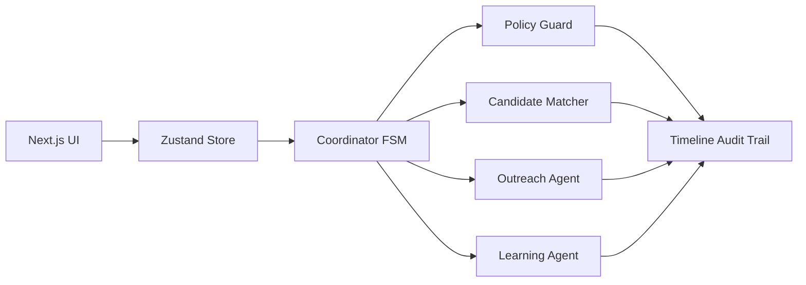

# Blankless

**No blank slots. No wasted capacity.**

Blankless is a deterministic hackathon demo of an autonomous appointment-recovery system for outpatient clinics. A cancellation triggers an auditable finite-state workflow that filters, ranks, contacts, confirms, and learns from waitlist outcomes.

## Demo spine

1. Scenario 1 cancels a Tuesday 2:30 PM dermatology follow-up.
2. Policy Guard blocks ineligible candidates with named rules.
3. Sofia declines an afternoon offer; Maya accepts.
4. Policy v2 raises time-of-day preference from 5% to 11%.
5. Scenario 2 ranks afternoon-flexible Chloe first and fills in one attempt.

## Architecture



The code is one deterministic workflow engine with pure modules. Persona labels are presentation and audit identities, not free-form agents chatting with each other.

## Local setup

```bash
npm install
npm run dev
```

Open `http://localhost:3000`, run Scenario 1, then Scenario 2.

## Verification

```bash
npm test
npm run build
```

## Safety and resilience

- Hard constraints run before scoring.
- Every block names its rule.
- A single-fill lock is enforced before recovery confirmation.
- No database, auth, live SMS, EHR connection, or real patient data.
- The demo works with zero environment variables.

## Sponsor adapter roadmap

Guild, Replay, Band, and Actian are deliberately isolated from the demo-critical local engine. Integration adapters can mirror the same typed events without changing the UI or deterministic core.
